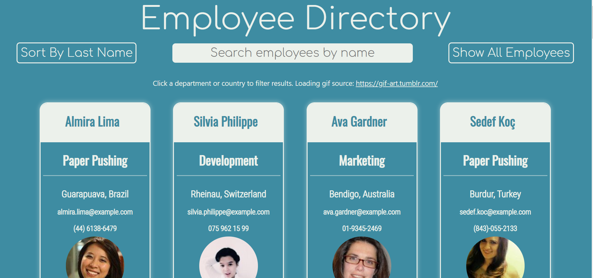

# React Search Directory

## Description
This react app creates an employee directory with data from randomuser.com. The user can choose the size of their employee base and all employees will be displayed. The user can then sort employees alphabetically by any data field, or sort to only show employees of any data field by clicking the appropriate field in any employee card. 

## Live site: 
https://youthful-yonath-367ab7.netlify.com/

## Screenshot

